# Infográfico: Responsabilidade no Não Repasse de Contribuições RPPS

## Cenário: Tesoureira desviou, ninguém sabia, nova equipe regularizou

```mermaid
flowchart TB
    TITLE["⚠️ NÃO REPASSE DE CONTRIBUIÇÕES RPPS\nQuem responde quando a tesoureira desvia e ninguém sabia?"]

    subgraph CENARIO["📌 O QUE ACONTECEU"]
        direction LR
        T1["🏦 Tesoureira reteve\ncontribuições do RPPS\ndescontadas dos servidores"]
        T2["💰 Usou o dinheiro para\npagar credores do município"]
        T1 -->|"desvio"| T2
    end

    subgraph SABIA["👁️ QUEM SABIA?"]
        direction LR
        TES["💼 TESOUREIRA\n✅ Sabia e agiu"]
        P["👨‍💼 PREFEITO\n❌ Não sabia"]
        SF["📊 SEC. FINANÇAS\n❌ Não sabia"]
    end

    subgraph CRIME["⚖️ ESFERA CRIMINAL — Art. 168-A CP / Peculato"]
        direction LR
        C1["🔴 TESOUREIRA\nSujeito ativo do crime\nPena: 2 a 5 anos + multa"]
        C2["🟢 PREFEITO\nSem dolo → não responde"]
        C3["🟢 SEC. FINANÇAS\nSem dolo → não responde"]
    end

    subgraph TCE["📋 ESFERA ADMINISTRATIVA — TCE"]
        direction LR
        A1["🔴 TESOUREIRA\nDébito solidário\n+ multa + ressarcimento"]
        A2["🟡 PREFEITO\nMulta por falha\nde controle interno"]
        A3["🟡 SEC. FINANÇAS\nMulta por falha\nde fiscalização"]
    end

    subgraph NOVA["🔄 NOVA EQUIPE — Plano de Ação"]
        direction TB
        N1["1️⃣ Documentar tudo\ndata da descoberta, valores, competências"]
        N2["2️⃣ Regularizar repasses\nANTES de qualquer autuação"]
        N3["3️⃣ Representar ao MP\ncontra a ex-tesoureira"]
        N4["4️⃣ Instaurar TCE / PAD\npara apurar o dano exato"]
        N5["5️⃣ Implementar controles\nconciliação mensal obrigatória"]
        N1 --> N2 --> N3 --> N4 --> N5
    end

    subgraph PROT["🛡️ PROTEÇÃO DA NOVA EQUIPE"]
        direction LR
        PR1["✅ Regularização espontânea\n= extinção da punibilidade\n(art. 168-A, §2º, CP)"]
        PR2["✅ Documentação completa\n= prova de boa-fé"]
        PR3["✅ Controles internos\n= prevenção futura"]
    end

    TITLE --> CENARIO
    CENARIO --> SABIA
    SABIA --> CRIME
    SABIA --> TCE
    CRIME --> NOVA
    TCE --> NOVA
    NOVA --> PROT

    classDef red fill:#ff6b6b,stroke:#c92a2a,color:#fff,font-weight:bold
    classDef yellow fill:#ffd43b,stroke:#e67700,color:#333,font-weight:bold
    classDef green fill:#69db7c,stroke:#2b8a3e,color:#333,font-weight:bold
    classDef blue fill:#74c0fc,stroke:#1864ab,color:#333,font-weight:bold
    classDef header fill:#364fc7,stroke:#1b2559,color:#fff,font-weight:bold,font-size:16px
    classDef title fill:#1b2559,stroke:#000,color:#fff,font-weight:bold,font-size:18px

    class TITLE title
    class C1,A1 red
    class C2,C3 green
    class A2,A3 yellow
    class N1,N2,N3,N4,N5 blue
    class PR1,PR2,PR3 green
```

---

## Legenda

| Cor | Significado |
|-----|-------------|
| 🔴 Vermelho | Responde criminal e administrativamente |
| 🟡 Amarelo | Multa administrativa (falha de fiscalização) |
| 🟢 Verde | Protegido / sem responsabilidade |
| 🔵 Azul | Ação recomendada para a nova equipe |

## Base legal

- **Art. 168-A, CP** — Apropriação indébita previdenciária (exige dolo)
- **Art. 312, CP** — Peculato (funcionário público que desvia recurso)
- **Art. 319, CP** — Prevaricação (não agir quando deveria)
- **Art. 168-A, §2º, CP** — Extinção da punibilidade pela regularização espontânea
- **Súmula 08, TCE/PE** — Parcelamento não isenta quem deu causa ao débito
- **Nota Técnica CNM 02/2024** — Responsabilidade individual por grau de participação
